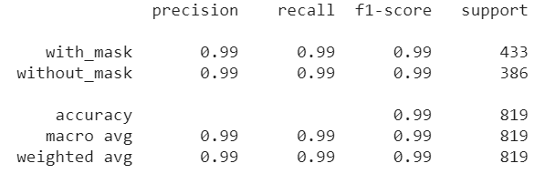
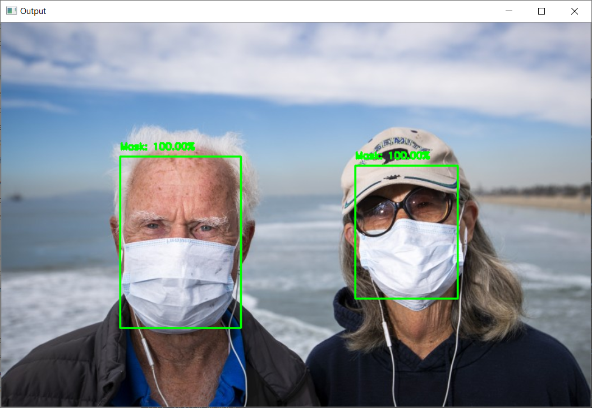

# Mask Detection using ResNet50 v2 


## Steps to run the ResNet50 v2

- Clone the Repository: <br>
```
git clone https://github.com/kshitiz-1225/Face_Mask_Detector.git
```
- Open the cloned project repository and Open terminal. Go into the cloned project directory and type the following command to train the model:
```
python ResNet50_v2/mask_with_resnet.py --dataset dataset --model "ResNet50_v2/ResNet50_mask_detector.model"
```

- In order to detect the face mask enter the following command:<br>
```
python detect_mask_image.py --image images/test1.jpeg --model ResNet50_v2/ResNet50_mask_detector.model
```


## Result 



## Output



